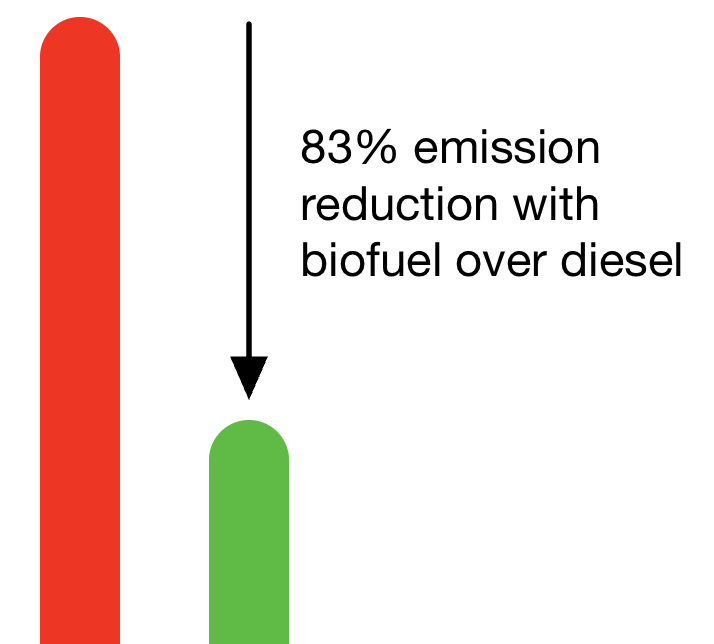
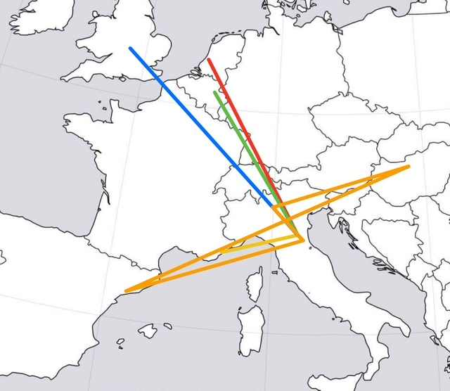
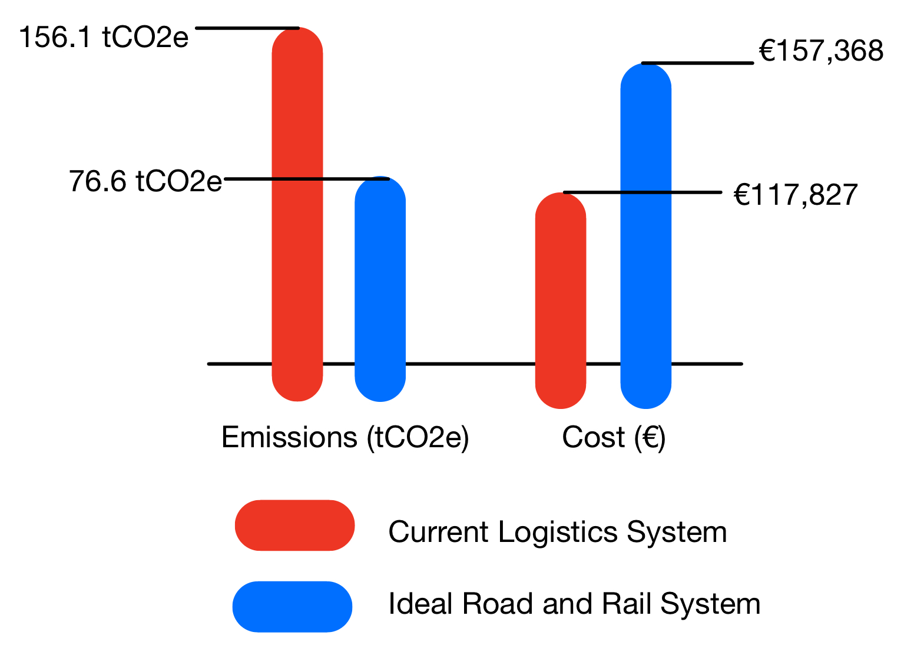

# Sustainability for Formula 1's Regional Logistics

Currently, Formula 1 uses trucks to ship supplies on short trips between races. In most parts of the world these trucks are powered by diesel fuel except in Europe where they're fueled by cleaner biofuel.

# An Idea for a Greener Future

While there are clear benefits with using a biofuel trucks over diesel, they still suffer from the key inefficiency any road vehicle has; it can only carry one trailer. A study by Martina Maria Petralia and Dr. Letizia Tebaldi of Parma University explores a hypothetical future where trains are used for team logistics during the European schedule. This hypothetical logistics system where rail and road are combined is compared with the current road based system in cost and carbon footprint, measured in tonnes of carbon dioxide equivalent (tCO2e), a measure of an emission's relative impact on climate change. The paper makes a sample logistics schedule using the Scuderia Ferrari HP team as an example:

Bologna-Zandvort-Bologna (red)
Bologna-Monaco-Bologna (yellow)
Bologna-Silverstone-Bologna (blue)
Bologna-Spa Francorchamps-Bologna (green)
Bologna-Imola-Barcelona-Budapest-Monza-Bologna (orange)

# Results of the Comparison

While the cost of using rail for the European part of the European schedule is about 15% more, the use of rail logistics would reduce carbon emissions by about half. This is an option which F1 will have to explore if they plan to reach their Net Zero by 2030 pledge. F1 has proven that they are interested in using trains for logistics, not in Europe but America, to bring equipment from Miami to Montreal for the Canadian Grand Prix. Time will tell if we see car chassis and Pirreli tyres travelling next to mattresses and computer parts on three mile long intermodal trains.
Contributed by Kārli Barobs

