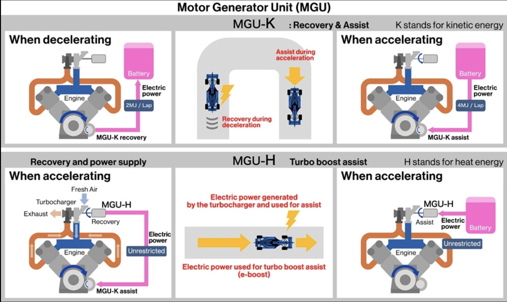

# Engineering Sustainable Performance: The 2026 F1 Hybrid Power Unit

## Leonard

# Can Formula 1 Be Fast *and* Net-Zero?

By 2030, Formula 1 wants to be **net-zero carbon**.  
From 2026, the cars get a new kind of **hybrid powertrain** that:

- Uses **100% “drop-in” sustainable fuel** (synthetic / bio-based fuel that can run in normal-style engines).
- Gets about **half its power from electricity** and half from the fuel-burning engine.

This page walks through the main design challenges explained in **plain English**:

- How the **engine and electric side share power**.
- How the car **keeps everything cool**.
- How the car **recycles energy** from braking and exhaust.

---

<!-- Diagram of an F1 car V6 powertrain with labels from: https://global.honda/en/tech/motorsports/Formula-1/Powertrain_V6_power_unit/-->

---

## 1. What Is an F1 Powertrain?

### 1.1 “Powertrain” in one sentence

The **powertrain** is everything that takes **energy** (fuel + electricity) and turns it into **force at the wheels**.

Think of it as the car’s **muscle system**:
- The **engine** is the burning-muscle part.
- The **battery + electric motor** is the electric-muscle part.
- The **control electronics** are the brain that coordinates them.

### 1.2 The main pieces

In the current hybrid era, an F1 power unit has:

- **Internal Combustion Engine (ICE)**  
  A tiny 1.6L turbo V6. It burns fuel, makes noise, and does most of the work today.

- **Turbocharger**  
  A little air compressor spun by exhaust gas. It forces more air into the engine so you can burn more fuel and make more power.

- **MGU-K (Motor Generator Unit – Kinetic)**  
  An electric machine connected to the crankshaft.
  - On **braking**, it acts like a generator: it slows the car a bit and charges the battery.
  - On **acceleration**, it acts like a motor: it pushes the car with electric power.

- **MGU-H (Motor Generator Unit – Heat)** *(being removed from 2026)*  
  Connected to the turbo.
  - It can harvest energy from the spinning turbo.
  - It can also spin the turbo to reduce “turbo lag”.

- **Energy Store (Battery)**  
  High-power lithium-ion pack. Not huge like a road EV, but it can deliver and absorb big bursts of power.

- **Power Electronics / Control Unit**  
  Decides how electricity flows between battery, MGU-K, MGU-H, and sometimes directly from exhaust to wheels.

### 1.3 Old vs new balance

Right now, roughly:
- **~80%** of power: from the engine.
- **~20%**: from the electric side. :contentReference[oaicite:0]{index=0}  

From **2026**, the rules push toward:
- **~50% engine, ~50% electric**, plus 100% sustainable fuel. :contentReference[oaicite:1]{index=1}  

That means the electric side is no longer just “extra boost” – it’s half the show.

---

<!-- INSERT IMAGE: Simple block diagram of power flows -->

*Fuel and electricity both take different paths, but all roads lead to the rear wheels.*

---

## 2. What “Net-Zero” and “Drop-In Sustainable Fuel” Actually Mean

### 2.1 What is “net-zero” in F1?

**Net-zero** doesn’t mean “no emissions from the exhaust pipe.”  
It means that, over a year, the **total CO₂ released** is **balanced** by:

- Cutting emissions where possible (more efficient engines, less fuel).
- Using **sustainable fuel** made from carbon that was already in the cycle (air, waste, biomass).
- Offsetting the rest with other projects.

For the **powertrain**, that means:

> “No **new** fossil carbon from underground. The carbon in the fuel should come from stuff that was already above ground.”

### 2.2 What is 100% “drop-in” sustainable fuel?

“**Drop-in**” means the fuel:

- Can be **used in normal-style gasoline engines** with only small tweaks.
- Can flow through **existing fuel distribution** systems (tanks, pipes, trucks). :contentReference[oaicite:2]{index=2}  

Where can this carbon-neutral fuel come from?

- **Captured CO₂** from the air or industrial fumes.
- **Waste biomass** (like leftovers from farming, not food crops).
- **Municipal waste** (garbage that would otherwise rot or be burned). :contentReference[oaicite:3]{index=3}  

The CO₂ that comes out the **exhaust** was already in the atmosphere or waste stream recently, so you’re not adding new CO₂ from underground oil.

### 2.3 Why fuel makes engineers sweat

Sustainable fuel is not just “normal gasoline but a nicer color.” It:

- Can burn **faster or slower**.
- Can change the **flame temperature and pressure**.
- Can change how hot the exhaust and turbo run.

That means:
- You may need to redesign **combustion chambers** and **injectors**.
- You must retune the **engine mapping** (timing, fuel flow, boost).
- All of that affects **heat**, **efficiency**, and **reliability**.

So the “green fuel” question is really:

> “Can we make fuel that’s friendly to the planet **and** friendly to a tiny, screaming 15,000 rpm engine?”

---

<!-- INSERT IMAGE: Fuel lifecycle loop -->

---

## 3. Design Challenge #1 – Hybrid Integration: Sharing Power Without Chaos

The new F1 car basically has **two engines**:

- One that burns **fuel** (ICE).
- One that uses **electricity** (MGU-K + battery).

They have to **share the work** while:

- Staying within power limits.
- Saving fuel.
- Not cooking the engine or battery.

### 3.1 Mental model: runner + e-scooter

Imagine:

- A **runner** (the engine) doing most of the work.
- An **electric scooter** (the motor) that can:
  - Push the runner on straights.
  - Charge itself when going downhill (braking).

The big question is always:

> “Who should work harder **right now**: runner or scooter?”

### 3.2 Control problem: who does what, when?

The control system (software + hardware) needs to decide, every split second:

- On **acceleration**:
  - How much power comes from the engine?
  - How much extra push from the electric motor?

- Under **braking**:
  - How much braking is done by MGU-K (regeneration)?
  - How much by normal hydraulic brakes, so the car stays stable?

- On **straights**:
  - Should the car **spend** stored electrical energy to go faster?
  - Or **save** it for later corners or overtakes?

With the 2026 push to roughly **50/50 engine–electric power**, bad decisions here can lose **tons of lap time**.

### 3.3 Why 50/50 is a big deal

When electric power was only ~20%:

- Teams could treat it as a **bonus**: helpful, but not life-or-death.

With ~50% electric:

- You **cannot** reach full performance without using the electric side properly.
- Energy management becomes as important as classical engine tuning.

This era also adds a new element: **manual electric boost** for the driver.

Under the new rules, the driver can activate a temporary, extra-power electric “overtake” mode. This gives a burst of acceleration for defending or attacking another car. However, the driver does not directly control how much power comes from the battery — they only request it. The car’s control system still decides the exact power flow to protect the battery, manage temperature, and stay within regulations.

### 3.4 Trade-offs

A few ways to mess this up:

- **Overspending electric early in the lap**  
  - Car feels amazing at the start of the lap.
  - Battery runs low later, so you’re a sitting duck on the straight.

- **Over-harvesting (charging too hard)**  
  - You drag the engine (or brakes) more to recharge the battery.
  - That slows the car and adds **extra heat** in both engine and battery.

- **Conservative strategy**  
  - You keep plenty of energy in the battery.
  - But you’re leaving free lap time on the table.

---

<!-- INSERT IMAGE: One-lap energy diagram -->

*Different parts of the lap: sometimes you save, sometimes you spend, sometimes you charge.*

---

## 4. Design Challenge #2 – Thermal Management: The Heat Problem

Every time you **convert energy**, you make **heat**.  

Modern F1 power units can hit **~50% thermal efficiency**, which is insanely high, but that also means the **other half** of the fuel’s energy is mostly heat. :contentReference[oaicite:4]{index=4}  

Now add:

- High-power battery.
- Motor-generators.
- Power electronics.

You’ve just built a **portable oven** that happens to go 300 km/h.

### 4.1 Where the heat comes from

Heat sources include:

- **Engine combustion** – hot gases, hot pistons, hot everything.
- **Turbo and exhaust** – exhaust gases can be hundreds of degrees.
- **Battery** – gets hot when charging and discharging fast.
- **MGU-K motor** – electric machines are not 100% efficient.
- **Power electronics** – inverters, DC-DC converters.
- **Brakes** – kinetic energy turned into heat at the discs.

### 4.2 Cooling without sacrificing speed

To remove heat, you need:

- **Radiators and coolers** – water, oil, battery coolant, etc.
- **Airflow** over those coolers.

The catch:

- More air → **more drag** → slower on straights.
- Bigger radiators → **more weight and more space** → harder packaging.

### 4.3 New challenges with more electric + new fuel

- More **electric power** → more **battery current** → more battery heat.
- More **regenerative breaking** → more hot brakes, more hot MGU-K, more hot electronics.
- **Sustainable fuel** may change:
  - Exhaust temperature.
  - How heat is distributed between engine, turbo, and exhaust. :contentReference[oaicite:5]{index=5}  

That means:

- You might need more or different **cooling circuits**.
- You might have to rethink how hot air leaves the car so it doesn’t **reheat** other components.

### 4.4 The cooling–drag–weight triangle

You can picture a three-way tug-of-war:

- **Cooling** – bigger radiators, more airflow.
- **Drag** – smooth, tight bodywork wants less airflow and smaller openings.
- **Weight** – more radiators, more fluid, more structure.

You can’t maximize all three. Typical trade-offs:

- Add cooling:
  - ✅ safer temperatures  
  - ❌ more drag and weight → slower lap.
- Reduce cooling:
  - ✅ less drag, more top speed  
  - ❌ risk of overheating – car has to back off or breaks.

### 4.5 What happens if they get it wrong?

Symptoms of bad thermal management:

- Driver gets messages like “cool the car” → must lift off the throttle and coast.
- Engine power gets reduced automatically to protect hardware.
- Battery temp goes high → power output or regenerative breaking gets limited.
- In worst cases: **DNF** (engine/battery failure) and millions of dollars go poof.

---

<!-- INSERT IMAGE: Heat map and air paths -->

*Red: hot zones (engine, exhaust, battery). Blue: cooling air paths. You want maximum cooling for minimum drag.*

---

## 5. Design Challenge #3 – Energy Recovery: Recycling Speed

Before talking about batteries or motors, here is the simple physical idea.

When any car slows down, it is throwing away energy.

That moving car contains **kinetic energy** (the energy of motion). In a normal car, braking turns almost all of that energy into **useless heat** in the brake pads and rotors.

Formula 1 tries to steal some of that “wasted” energy back.

It does this using an electric machine that can work in reverse.

### 5.1 What is regenerative braking? 

An electric motor can also act as a **generator**.

- As a motor → it uses electricity to spin the wheels.
- As a generator → it resists the wheels and creates electricity.

So when the driver hits the brakes, part of the braking force in an F1 car does NOT come from brake pads.

Instead, it comes from the electric motor “pushing back” against the wheels and turning that motion into **stored electrical energy in the battery**.

This is called **regenerative braking (regen)**.

Think of it like: Instead of grinding away speed as heat, the car is trying to store that speed for later.

---

### 5.2 The critical problem: regen acts on the REAR wheels only

The regenerative motor (called the **MGU-K**) is connected to the engine and drivetrain, which drive the **rear wheels**.

That means:
- Front wheels: slow down using brake pads only
- Rear wheels: slow down using **brake pads + electric motor resistance**

This creates an imbalance during braking.

The physics shows:

When you brake hard, the car’s weight shifts **forward**.
This means:
- Front tires get **more grip**
- Rear tires get **less grip**

So you now have a dangerous situation:

The tires with **the least grip** (rear tires)
are being asked to **do the most braking** (pads + regen motor).

If the motor resists even a little too much:
- Rear wheels slow down faster than the front
- Rear tires lose grip
- The back of the car starts to slide or spin

That is why regen is risky in a race car because **it only acts on the weakest end of the car during braking**.

This is why “brake blending” is so critical.

---

### 5.3 What is brake blending? (And why it’s insanely hard)

The driver presses **one brake pedal**.

But the car is actually doing two different types of braking:

1) Regular hydraulic brakes (pads and discs)
2) Electric regenerative braking (MGU-K)

The computer must blend them perfectly so the driver feels:
One smooth, predictable stopping force

If the blend is even a little bit off:
- Braking feels weird
- Rear slides, locks, or steps out
- Driver loses confidence
- Lap time dies (or wall is introduced to side of car)

This blending has to be adjusted constantly based on:
- Tire grip
- Speed
- Battery charge
- Temperature
- Track surface
- Driver input

That is why dozens of engineers obsess over this system.

---

### 5.4 The machines that do the energy recovery

Now that regen is clear, here are the parts that do it:

- **MGU-K (Motor Generator Unit – Kinetic)**  
  Connected to the drivetrain and rear wheels.
  - On braking → it becomes a generator and charges the battery
  - On acceleration → it becomes a motor and boosts the car

- **MGU-H (Motor Generator Unit – Heat)** *(used in current system, removed in 2026)*  
  Connected to the turbo.
  - It harvests energy from hot exhaust
  - It can send energy:
    - to the battery, or
    - directly to the MGU-K (skipping the battery and reducing losses)

This is why F1 is so special:  
It is stealing energy from **both** braking **and** exhaust heat — two places normal cars completely waste.

---

### 5.5 How much energy can actually be recovered?

On a typical lap:

- The MGU-K can recover about **20% of the car’s braking energy** on average
- Some tracks allow more (lots of slow corners and opportunities to brake)
- Some tracks allow less (fast flowing corners or longer straights)

But recovery is always limited by:

- Tire grip (too much regen = spin risk)
- Battery temperature and capacity
- Rules set by the FIA
- Overall balance of the car

---

### 5.6 The strategy problem: harvest, save… or smash the boost button

The harvested energy is stored in the battery. That stored energy is the car’s **secret weapon**.

It can be used to:

- Boost out of corners
- Defend a position
- Attack for an overtake
- Reduce fuel use by backing off the engine

Under the new rules, the driver has access to a **manual electric boost button** (often called “overtake” mode). 

The important part is:
The driver does NOT directly control how much power comes from the battery.  
They only **request it**. The car’s computer still decides the exact amount, based on:

- How full the battery is
- How hot the battery and motor are
- What the rules allow
- Whether giving full boost is safe

So the driver’s role becomes **strategic**, not technical.

They have to decide things like:

- Do I use boost now to pass this car?
- Or do I save it for the long straight in Sector 3?
- Do I defend my position, or gamble it for later?

Meanwhile, the system is deciding:

- Do we recover MORE energy into the battery right now?
- Or do we reduce regen to protect rear grip and stability?
- Do we allow maximum boost?
- Or do we limit it because the battery is too hot?

This turns energy recovery into a **resource management game** shared between:
- The driver (when to use it)
- The engineers (how it’s programmed)
- The car’s computer (how it’s executed)

---

<!-- INSERT IMAGE: corner energy recovery diagram -->

*Into the corner: you harvest. Out of the corner: you spend. The magic is in the timing.*

---

## 6. Putting It All Together: System-Level Trade-Offs

The nasty part is: all these things interact.

Change one knob, three others move.

### 6.1 Scenario 1 – Hot race, twisty track

Imagine:

- A very hot day.
- A twisty street circuit with lots of slow corners and heavy braking.

What happens?

- Lots of braking → lots of energy recovery → **battery and MGU-K heat up**.
- Brakes also get hotter.
- Engine runs hot because air temps are high.

To keep things safe, engineers might:

- **Open up the cooling** (bigger air inlets, different bodywork):
  - ✅ Lower temperatures.
  - ❌ More drag → slower on straights.

- **Harvest a bit less energy**:
  - ✅ Less battery and brake heat.
  - ❌ Less electric boost later → slower lap times.

So they have to decide:

> “Do we want *maximum* performance for a few laps, or *very high* performance for the whole race without cooking the car?”

### 6.2 Scenario 2 – Qualifying lap vs race stint

- **Qualifying** (one or two flying laps):
  - Use **aggressive hybrid strategy**.
  - Spend more battery, accept higher temperatures for a short time.
  - Maybe run tighter bodywork for less drag, gambling that the car won’t overheat in just a few laps.

- **Race stint** (dozens of laps):
  - Dial back power slightly.
  - Use **more conservative energy recovery and boost**.
  - Run more cooling to keep things in a safe window.

Same hardware, completely different settings because the **time horizon** is different.

### 6.3 Big-picture trade-offs

You can think of three big sliders:

1. **Speed vs Efficiency**
   - Go flat-out → burn more fuel, run hotter, use more battery cycles.
   - Drive slightly under the limit → save fuel, keep temps in check, maybe have more power at the end.

2. **Complexity vs Reliability**
   - Super advanced control software → brilliant when it works, but harder to calibrate and debug.
   - Simpler strategies → more robust, but might miss the last few tenths.

3. **Performance vs Sustainability goals**
   - F1 wants:
     - Net-zero carbon.
     - Engines and fuels that teach us something useful for road tech.
   - But fans expect:
     - Ridiculous lap times.
     - Wheel-to-wheel racing.
     - Reliability good enough that championships aren’t decided by random explosions.

The engineering question is:

> “Can we design a powertrain that helps the planet **and** still scares the driver a little on every lap?”

---

<!-- INSERT IMAGE: System interaction map -->

*Change fuel → change combustion → change heat → change cooling → change drag → change lap time. Everything is connected.*

---

## 7. Why This Matters Beyond F1

F1 is an extreme, expensive sandbox. But the lessons don’t stay on the track.

### 7.1 Lessons for road cars

Things that can trickle down:

- **Better hybrid strategies**  
  - Smarter software that decides when to use engine vs electric.
  - Smoother blending of regen and hydraulic brakes.

- **Thermal management tricks**  
  - Compact, efficient coolers.
  - Smarter coolant routing and control.

- **Sustainable fuels**  
  - If F1 proves that truly high-performance engines can run on **drop-in sustainable fuel**, that’s a big data point for aviation, shipping, and legacy cars that can’t easily go full EV. :contentReference[oaicite:11]{index=11}  

### 7.2 F1 as a “lab on wheels”

Why do car companies care?

- They get to test ideas in **the harshest possible environment**:
  - Tiny engines making huge power.
  - Massive power density in batteries and motors.
  - High vibration, high temperature, long races.

If it survives **here**, it might be overbuilt (in a good way) for your daily commute.

### 7.3 Is “net-zero and fast” actually realistic?

Honest answer:

- The **fuel side** can be net-zero-ish if the whole production chain is truly green, but it’s expensive and hard to scale. :contentReference[oaicite:12]{index=12}  
- The **electrification** push clearly helps efficiency.
- The rest of F1’s carbon footprint (freight, flights, factories) also matters a lot.

So “net-zero and fast” is:

- Not pure marketing fluff.
- Not magically solved.
- A **huge optimization problem** across technology, cost, and rules.

What’s cool is that:

> The same tools F1 uses to shave tenths off a lap — simulations, control algorithms, energy models — are the tools we need to squeeze waste out of the whole energy system.

---

<!-- INSERT IMAGE: Tech transfer from F1 to the world -->

*Ideas don’t stay on the grid. Hybrid control, cooling solutions, and fuels can ripple outward.*

